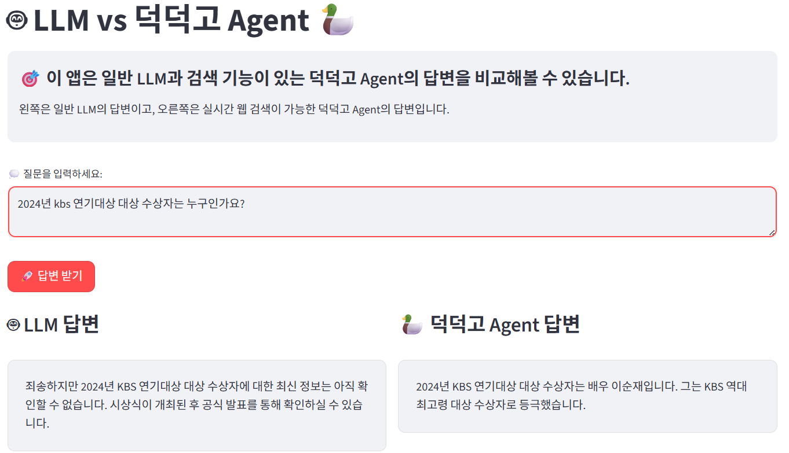

# 🤖 LLM vs DuckDuckGo Agent 비교 도구

일반 LLM과 웹 검색 기능을 가진 DuckDuckGo Agent의 답변을 실시간으로 비교할 수 있는 웹 애플리케이션입니다.

## 📱 두 가지 버전 제공

이 프로젝트는 **Flask**와 **Streamlit** 두 가지 버전으로 제공됩니다:

### 🌐 Flask 버전 (권장)
- 현대적인 하늘색 테마의 웹 인터페이스
- API 키 검증 버튼과 향상된 UX
- 반응형 디자인으로 모든 기기 지원
- 좌우 배치로 답변 비교


### ⚡ Streamlit 버전
- 빠른 프로토타이핑용 간단한 인터페이스
- Streamlit 기본 컴포넌트 활용
- 개발자 친화적인 환경



## ✨ 주요 기능

- **실시간 비교**: 일반 LLM과 웹 검색 Agent의 답변을 동시에 확인
- **웹 검색 통합**: DuckDuckGo를 통한 최신 정보 검색
- **깔끔한 UI**: Chrome 브라우저 스타일의 모던한 인터페이스
- **한국어 최적화**: 한국어 시스템 프롬프트와 UI

## 🏗️ 프로젝트 구조

```
duckduckgo_agent/
├── app.py                 # Flask 메인 애플리케이션
├── llm_agent_compare.py   # Streamlit 버전
├── requirements.txt       # Python 의존성 패키지
├── .env_example          # 환경변수 예시 파일
├── .gitignore           # Git 무시 파일 설정
├── README.md            # 프로젝트 문서
├── static/              # Flask 정적 파일
│   ├── css/
│   │   └── style.css    # 하늘색 테마 CSS
│   └── js/
│       └── script.js    # 프론트엔드 JavaScript
└── templates/           # Flask HTML 템플릿
    └── index.html       # 메인 페이지
```

## 🚀 설치 및 실행

### 1. 저장소 클론
```bash
git clone https://github.com/glassesholder/2024_duckduckgo_agent.git
cd 2024_duckduckgo_agent
```

### 2. 가상환경 생성 및 활성화
```bash
python -m venv venv
# Windows
venv\Scripts\activate
# macOS/Linux
source venv/bin/activate
```

### 3. 의존성 설치
```bash
pip install -r requirements.txt
```

### 4. 환경변수 설정 (선택사항)
```bash
# .env_example을 .env로 복사하고 필요시 수정
cp .env_example .env
```

**LangSmith 추적 활성화** (선택사항):
- LangSmith를 통해 AI 답변 생성 과정을 상세히 추적할 수 있습니다
- `.env` 파일에서 `LANGCHAIN_TRACING_V2="true"`로 설정
- 프로젝트명과 엔드포인트를 설정하여 답변 품질 분석 가능

### 5. 애플리케이션 실행

#### Flask 버전 실행 (권장)
```bash
python app.py
```
브라우저에서 `http://localhost:5000`으로 접속하세요.

#### Streamlit 버전 실행
```bash
streamlit run llm_agent_compare.py
```
자동으로 브라우저가 열리며 `http://localhost:8501`에서 실행됩니다.

## 🔧 사용 방법

1. **OpenAI API 키 입력**: 유효한 OpenAI API 키를 입력하세요
2. **질문 작성**: 비교하고 싶은 질문을 입력하세요
3. **답변 비교**: "답변 비교하기" 버튼을 클릭하여 결과를 확인하세요

### 예시 질문
- "2024년 최신 AI 트렌드는 무엇인가요?"
- "오늘 날씨는 어떤가요?"
- "최근 기술 뉴스를 알려주세요"

## 🛠️ 기술 스택

### Backend
- **Flask**: 웹 프레임워크
- **LangChain**: LLM 및 Agent 관리
- **OpenAI GPT-4.1-mini**: 언어 모델
- **DuckDuckGo Search**: 웹 검색 도구

### Frontend
- **HTML5**: 마크업
- **CSS3**: Chrome 스타일 디자인
- **Vanilla JavaScript**: 동적 기능
- **Font Awesome**: 아이콘

## 🎯 주요 특징

### 🌟 Flask 버전 특징
- **하늘색 테마**: 아름다운 그라데이션과 글래스모피즘 효과
- **API 키 검증 버튼**: 별도 버튼으로 안전한 키 검증
- **좌우 배치**: LLM과 Agent 답변을 나란히 비교
- **반응형 디자인**: 모든 기기에서 최적화된 경험
- **향상된 UX**: 부드러운 애니메이션과 시각적 피드백

### ⚡ Streamlit 버전 특징
- **빠른 개발**: 간단한 코드로 빠른 프로토타이핑
- **자동 UI**: Streamlit의 자동 UI 생성
- **개발자 친화적**: 코드 변경 시 자동 새로고침

### 🧠 공통 AI 기능
- **지능형 검색 쿼리**: 최적화된 검색어 자동 생성
- **실시간 날짜**: 현재 날짜 정보 자동 포함
- **한국어 최적화**: 한국어 자연어 처리에 특화
- **출처 제공**: 검색 결과 출처 명시
- **🔍 LangSmith 추적**: 답변 생성 과정을 실시간으로 모니터링하고 분석

## 🔒 보안 고려사항

- **API 키 보안**: 클라이언트 측에서만 처리되며 서버에 저장되지 않음
- **환경변수 관리**: `.env` 파일을 통한 안전한 설정 관리
- **실시간 검증**: API 키 유효성 즉시 확인

## 📊 성능 및 특징 비교

| 특징 | Flask 버전 | Streamlit 버전 |
|------|------------|----------------|
| 🎨 디자인 | 커스텀 하늘색 테마 | 기본 Streamlit 테마 |
| 📱 반응형 | 완전 반응형 | 부분 반응형 |
| ⚡ 속도 | 빠름 | 매우 빠름 |
| 🔧 커스터마이징 | 높음 | 중간 |
| 👨‍💻 개발 편의성 | 중간 | 높음 |
| 🚀 배포 | 표준 웹앱 | Streamlit Cloud |

---

*두 가지 버전 모두 동일한 AI 기능을 제공하며, 사용 목적에 따라 선택하여 사용하세요!*
